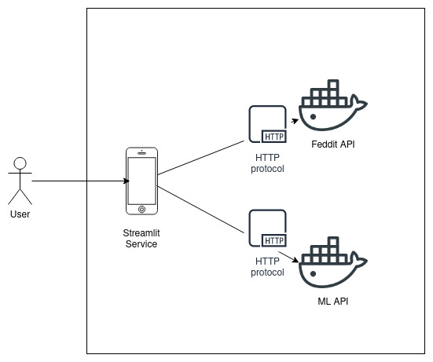
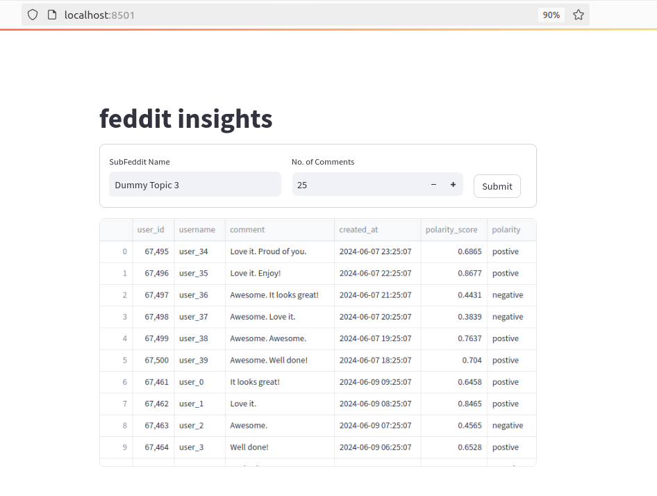

# Allianz MLOps Assignment

## Architecture

The application is a total of 3 microservices, which are:
- UI service written in streamlit
- Subfeddit api written in FastAPI
- ML api written in Flask



## Running the application

Clone the repo:
```bash
git clone https://github.com/TheRochVoices/allianz_mle_assignment.git
cd allianz_mle_assignment
```
Install the requirements
```bash
pip install -r requirements.txt
```
up the feddit api:
```bash
docker compose -f subfeddit_api/docker-compose.yml up
```
up the ML api:
```bash
docker run -p 5000:5000 therochvoices/allianz_ml:v1
```
up the UI service:
```bash
streamlit run app.py
```
It then exposes a UI that looks like this:


Also, a linting github pipeline is added to the repo: https://github.com/TheRochVoices/allianz_mle_assignment/actions
